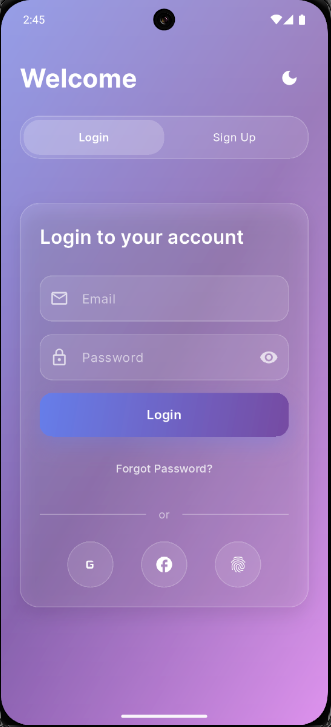
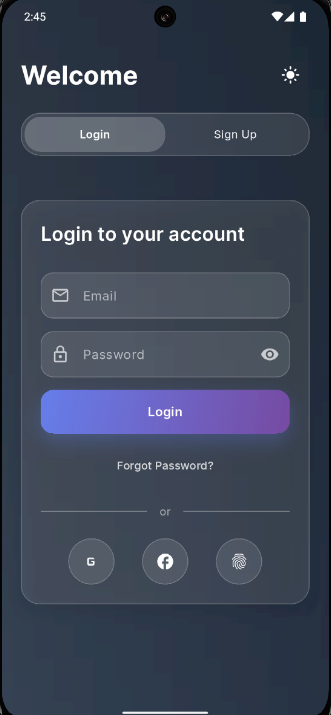

# ✨ Smart, Elegant & Animated Login & Sign Up UI – Flutter

This project is part of my **100 Days Flutter Challenge** – Day 3: A beautifully crafted **Login and Sign Up UI** with animation, elegant layout, and smart design patterns.

## 📱 Screens

- 🔐 **Login Screen**  
  With floating input fields, custom fonts, and animated transitions.

- 📝 **Sign Up Screen**  
  Smooth navigation from Login → Sign Up with a toggle switch and gradient button animations.


---

## 🖼️ Preview

| Home Light | Home Dark |
|-------------|----------|---------------|

|  |  |

---


## 🎯 Features

✅ Clean and elegant UI  
✅ Animated transition between Login ↔ Sign Up  
✅ Smart layout (responsive and user-friendly)  
✅ Soft shadows, glowing highlights, and rounded input fields  
✅ Password show/hide toggle  
✅ Google Fonts for modern typography  
✅ Reusable and maintainable code structure

## 📦 Dependencies

Only one package used:

```yaml
google_fonts: ^6.1.0
